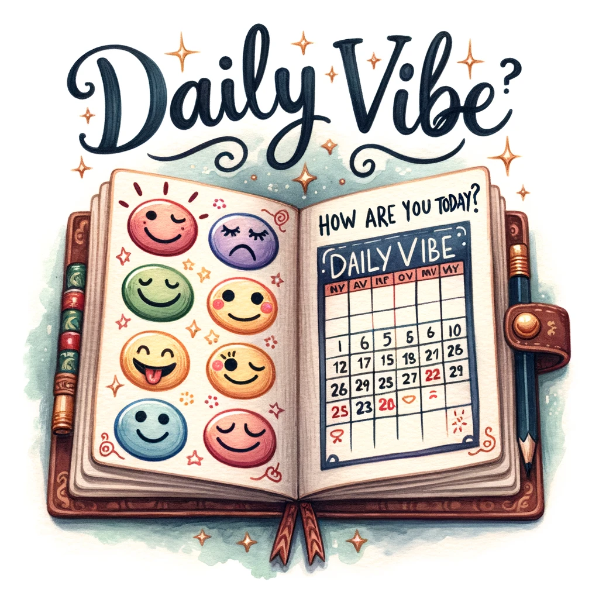

# Daily Vibe: Your Daily Mood Tracker

---

:warning: **Project In Progress**: Please note that this project is currently under development. Features may not be fully functional, and the content is subject to change. We appreciate your patience and understanding as we work to bring you the best experience!

---

## Description

Daily Vibe is a Chrome extension designed to help you track your daily mood. It asks you every day, "How are you?" but phrases it differently each time for a refreshing experience. Rate your mood and leave a sentence if you like. Access your mood progression over the year through a beautifully designed chart.

## Features

- **Daily Mood Check**: A simple, non-intrusive notification asking you about your mood.
- **Randomized Questions**: The question changes every day to keep the interaction engaging.
- **Mood Rating**: Rate your mood on a scale from 1 to 5.
- **Optional Sentence**: Leave a brief note or sentence about why you feel the way you do.
- **Yearly Progression Chart**: Visualize your mood over the year to gain insights into your emotional health.

## Contact

- GitHub: [amine-abdelli](https://github.com/amine-abdelli)
- Email: amine.abdelli@outlook.fr